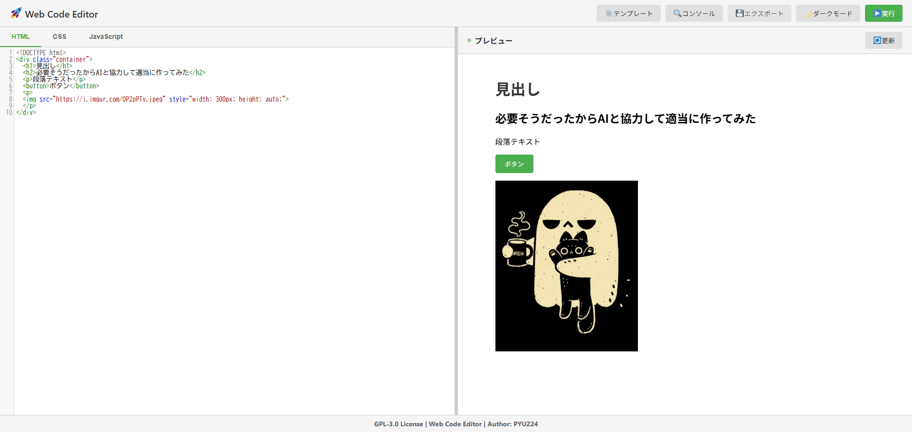

# 🚀 Web Code Editor

シンプルで使いやすいブラウザベースのコードエディタ。HTML、CSS、JavaScriptをリアルタイムでプレビューしながら開発できます。



## ✨ 主な機能

### エディタ機能
- 📝 **3つのエディタタブ** - HTML、CSS、JavaScriptを切り替えて編集
- 👀 **リアルタイムプレビュー** - コードを書くと自動的に結果を表示
- ✨ **Emmet対応** - HTML/CSSの省略記法でコーディングを高速化
  - 例: `html:5`, `ul>li*3`, `.container` など
- 🎨 **コード整形機能** - Prettierでワンクリック整形
- 🔍 **検索・置換機能** - 高度な検索と置換（正規表現対応）
- 💬 **コメントアウト** - `Ctrl/Cmd + /` で素早くコメント追加/削除

### プレビュー機能
- 📱 **レスポンシブプレビュー** - デバイス別に表示確認
  - デスクトップ（100%）
  - タブレット（768px）
  - モバイル（375px）
- 🔄 **レイアウト切り替え** - 横分割/縦分割の選択可能
- 🖥️ **コンソール出力** - JavaScriptのログやエラーを確認

### その他の機能
- 📚 **外部ライブラリ簡単追加** - よく使うライブラリをワンクリックで
  - jQuery、Bootstrap、Tailwind CSS、Vue.js、Axios、GSAP、Font Awesome
- 🔗 **SNS共有** - Twitter、Facebook、LINEでコードを簡単にシェア
- 💾 **自動保存** - LocalStorageに自動保存、ページを閉じても安心
- 🌙 **ダークモード** - 目に優しいダークテーマ対応
- 📄 **テンプレート** - 空白、基本HTML、Flexbox、Grid、アニメーション、インタラクティブ
- 💾 **エクスポート機能**
  - HTMLファイルとしてダウンロード
  - CodePen/JSFiddle形式でコピー
  - ZIPファイル（HTML/CSS/JS分離）でダウンロード
- 📱 **レスポンシブ対応** - モバイル・タブレットでも快適に動作
- 🔧 **パネルリサイズ** - エディタとプレビューのサイズを自由に調整

## ⌨️ キーボードショートカット

- `Ctrl/Cmd + S` - コードを保存
- `Ctrl/Cmd + Enter` - コードを実行
- `Ctrl/Cmd + Shift + F` - コードを整形
- `Ctrl/Cmd + F` - 検索
- `Ctrl/Cmd + H` - 置換
- `Ctrl/Cmd + /` - コメントアウト/解除

## 🚀 使い方

### 基本的な使い方

1. リポジトリをクローン
```bash
git clone https://github.com/PYU224/web-code-editor.git
cd web-code-editor
```

2. 環境変数の設定
```bash
# .env.example を .env にコピー
cp .env.example .env

# .env ファイルを編集してサイト情報を設定
# SITE_URL: あなたのサイトのURL
# OGP_IMAGE_URL: SNSシェア時に表示される画像のURL
```

3. Webサーバーで起動（例：ローカル環境でのPHP開発サーバ）
```bash
php -S localhost:8000
```

4. ブラウザで `http://localhost:8000` を開く

または、`index.php`を直接ブラウザで開くことも可能です。

### OGP（SNSシェア）設定

サイトをSNSでシェアした際の表示を最適化できます。

1. `.env` ファイルを編集：
```env
SITE_URL=https://your-domain.com
SITE_NAME=Web Code Editor
SITE_DESCRIPTION=あなたのサイトの説明
OGP_IMAGE_URL=https://your-domain.com/ogp-image.png
TWITTER_CARD=summary_large_image
```

2. OGP画像を用意：
   - 推奨サイズ: 1200x630px
   - 形式: PNG, JPG
   - `/program/ogp-image.png` に配置（または任意のパス）
   - 詳しい作成方法は [OGP_IMAGE_GUIDE.md](OGP_IMAGE_GUIDE.md) を参照

3. 設定ファイル：
   - `program/config.php` - 環境変数の読み込み
   - `program/ogp.php` - OGPメタタグの生成
   - これらは `index.php` で自動的に読み込まれます

4. 本番環境へのデプロイ：
   - 詳しい手順は [DEPLOY.md](DEPLOY.md) を参照

**注意**: `.env` ファイルは機密情報を含むため、Gitにコミットしないでください（`.gitignore`に含まれています）。

## 🎯 新機能の使い方

### Emmet省略記法
HTML/CSSエディタで省略記法を入力後、**Tabキー**を押すと展開されます。

```
html:5 → HTML5のテンプレート
ul>li*3 → <ul><li></li><li></li><li></li></ul>
.container → <div class="container"></div>
div.header>h1+nav → <div class="header"><h1></h1><nav></nav></div>
```

### コード整形
1. 整形したいコードのタブを選択（HTML/CSS/JS）
2. 「✨ 整形」ボタンをクリック
3. または `Ctrl/Cmd + Shift + F` を押す

### 検索・置換
1. `Ctrl/Cmd + F` で検索ダイアログを開く
2. `Ctrl/Cmd + H` で置換ダイアログを開く
3. 正規表現検索も利用可能

### コメントアウト
1. コメントアウトしたい行を選択
2. `Ctrl/Cmd + /` を押す
3. もう一度押すとコメント解除

### レスポンシブプレビュー
1. プレビューヘッダーのデバイスアイコンをクリック
2. 🖥️ デスクトップ / 📱 タブレット / 📱 モバイル から選択
3. 選択したサイズでプレビューが表示される

### レイアウト切り替え
1. ヘッダーの「🔄 レイアウト」ボタンをクリック
2. 横分割（左右）⇄ 縦分割（上下）が切り替わる

### 外部ライブラリ追加
1. 「⚙️ 設定」ボタンをクリック
2. 「📚 外部ライブラリ」セクションで使いたいライブラリにチェック
3. コード実行時に自動的にライブラリが読み込まれる
4. 利用可能なライブラリ：
   - jQuery 3.7.1
   - Bootstrap CSS/JS 5.3
   - Tailwind CSS 3.4
   - Vue.js 3.4
   - Axios 1.6
   - GSAP 3.12
   - Font Awesome 6.5

### SNS共有
1. 「🔗 共有」ボタンをクリック
2. Twitter、Facebook、LINEから選択してシェア
3. または共有URLをコピーして自由に配布

## 🛠️ 技術スタック

- **CodeMirror 5.65.2** - コードエディタコンポーネント
  - search addon - 検索・置換機能
  - comment addon - コメントアウト機能
- **emmet-codemirror 1.2.4** - Emmet省略記法サポート
- **Prettier 2.8.8** - コード整形エンジン
- **JSZip 3.10.1** - ZIP形式エクスポート
- **Twemoji** - 絵文字表示
- **Vanilla JavaScript** - フレームワーク不使用

## 📦 ファイル構成

```
web-code-editor/
├── index.php          # メインHTMLファイル
├── .env               # 環境変数（要作成、Gitには含まれない）
├── .env.example       # 環境変数のサンプル
├── .gitignore         # Git除外設定
├── program/
│   ├── design.css     # スタイルシート
│   ├── script.js      # JavaScript
│   ├── ogp.php        # OGPメタタグ生成
│   ├── config.php     # 設定ファイル（.envを読み込み）
│   └── favicon.ico    # ファビコン
├── README.md          # このファイル
└── CHANGELOG.md       # 変更履歴
```

## 🌐 ブラウザ対応

- Chrome/Edge 90+
- Firefox 88+
- Safari 14+

## 📄 ライセンス

MIT License

## 👤 作者

**PYU224**<br>
https://linksta.cc/@pyu224

## 🤝 貢献

Issue、Pull Requestを歓迎します！

## 🙏 謝辞

- [CodeMirror](https://codemirror.net/) - 素晴らしいエディタライブラリ
- [Emmet](https://emmet.io/) - 高速コーディングツール
- [Prettier](https://prettier.io/) - コード整形ツール
- [JSZip](https://stuk.github.io/jszip/) - ZIPファイル生成
- [Twemoji](https://twemoji.twitter.com/) - 絵文字アイコン
